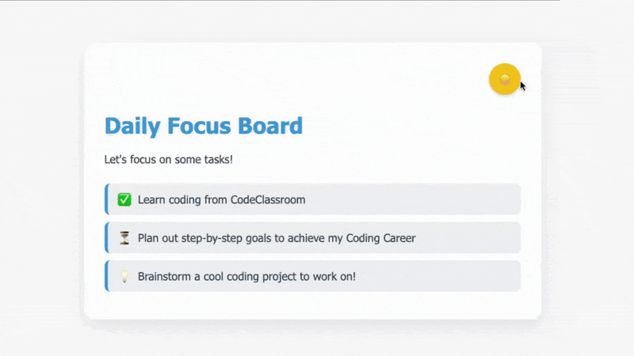

# Dark Mode Toggle
A simple **Dark Mode Toggle** on a Daily Focus Board created using **HTML, CSS, and JS**

## 📺 Full Code Walkthrough (YouTube Video)

[👉 Click here to watch the full YouTube tutorial!](https://www.youtube.com/watch?v=VIDEO_ID)

